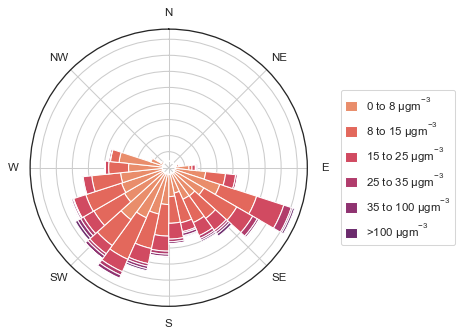

.. currentmodule:: atmospy

.. _pollution_rose:

PM2.5 by Direction
==================

**atmospy components used:** :func:`set_theme`, :func:`load_dataset`, :func:`pollutionroseplot`

.. literalinclude:: pollution_rose.py
    :lines: 7-

