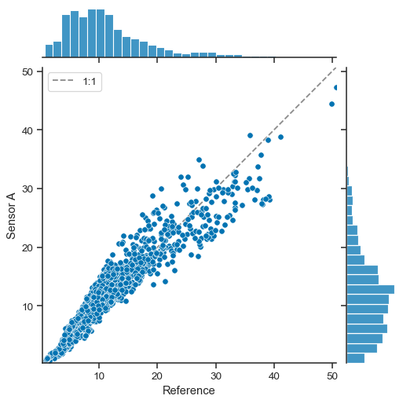
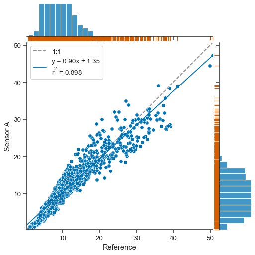
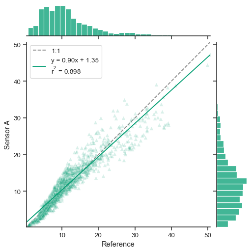
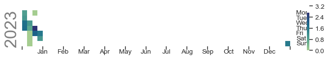
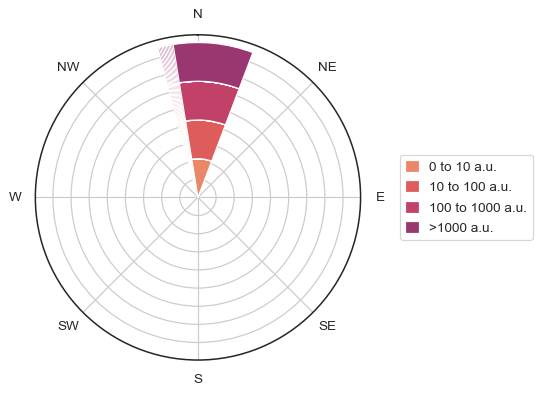

.. _plots:

.. currentmodule:: atmospy

Plotting Functions
===================

Atmospy is a library for making useful, professional figures for atmospheric chemistry and air 
quality professionals. It is built on top of `matplotlib <https://matplotlib.org/>`_, 
`pandas <https://pandas.pydata.org/>`_, and `seaborn <https://seaborn.pydata.org>`_. Below, 
we will walk through examples of how to use atmospy and how you can extend it with 
seaborn and matplotlib.

.. code:: ipython3

    import atmospy
    import pandas as pd
    import numpy as np
    import seaborn as sns
    import matplotlib.pyplot as plt
    
    atmospy.set_theme()

Comparing Data from Multiple Sensors
------------------------------------

Often, we find the need to compare multiple variables against one
another. In the air sensor world, this may be the regression of two
variables against one another or one air sensor against a reference
sensor. Using the ``atmospy.regplot``, we can easily plot the regression
between two variables, fit a linear model, and display the fit
parameters on the figure itself:

.. code:: ipython3

    df = atmospy.load_dataset("air-sensors-pm")
    
    # plot the Reference measurement vs Sensor A using defaults
    atmospy.regplot(df, x="Reference", y="Sensor A");

.. image:: plots_files/plots_3_0.png

Under the hood, ``atmospy.regplot`` is simply making a call to seaborn’s
``jointplot`` function with a few added pieces including adding a unity
line and displaying the fit parameters for the linear model in the
legend.

The call returns a seaborn ``JointGrid`` which is a group of subplots.
As seen above, the joint axis shows the relationship between the two
variables with a unity line (1:1), the best fit line (shown in solid
blue above), and the distributions for each variables shown on the
marginal axes.

If for some reason, you *don’t* want to fit a linear model to the data,
you can turn that functionality off by setting ``fit_reg=False``:

.. code:: ipython3

    atmospy.regplot(df, x="Reference", y="Sensor A", fit_reg=False);

Because we’re just making a call to seaborn’s ``jointplot`` function,
you can send along most configuration options as keyword arguments to
``atmospy.regplot``. For example, if you wanted to change what is shown
on the marginal axes, you can:

.. code:: ipython3

    atmospy.regplot(df, x="Reference", y="Sensor A", marginal_kws={"bins": 25, "fill": False});

.. image:: plots_files/plots_7_0.png

A ``JointGrid`` object is returned, which allows you to continue
customizing as you’d like:

.. code:: ipython3

    g = atmospy.regplot(df, x="Reference", y="Sensor A")
    g.plot_marginals(sns.rugplot, color='r', height=-0.15, clip_on=False);

You can easily edit the marker choice, color of marker, or anything else
as well:

.. code:: ipython3

    atmospy.regplot(df, x="Reference", y="Sensor A", color='g', marker="^", alpha=.15);

Evaluating Trends
-----------------

.. code:: ipython3

    bc = atmospy.load_dataset("us-bc")
    
    # Select just a single location
    single_bc = bc[bc["Location UUID"] == bc["Location UUID"].unique()[0]]
    
    atmospy.calendarplot(data=single_bc, x="Timestamp GMT", y="Sample Measurement")

.. parsed-literal::

    /Users/dhhagan/Documents/github/atmospy/atmospy/atmospy/trends.py:69: UserWarning: FixedFormatter should only be used together with FixedLocator
      ax.xaxis.set_ticklabels([

Identifying Sources
-------------------

.. code:: ipython3

    met = atmospy.load_dataset("air-sensors-met")
    
    atmospy.pollutionroseplot(data=met, ws="ws", wd="wd", pollutant="pm25")

-  Comparing data
-  evaluating trends
-  diel
-  calendar
-  where is it coming from?
