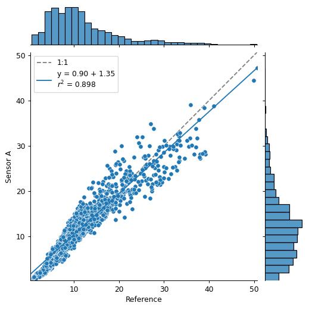
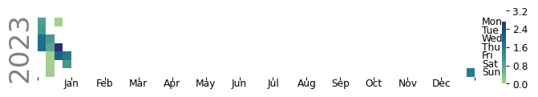
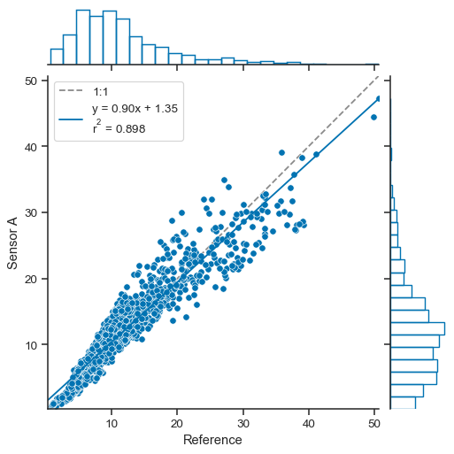

.. _plots:

.. currentmodule:: atmospy

Plotting Functions
===================

Seaborn is a library for making statistical graphics in Python. It builds on top of `matplotlib <https://matplotlib.org/>`_ and integrates closely with `pandas <https://pandas.pydata.org/>`_ data structures.

Seaborn helps you explore and understand your data. Its plotting functions operate on dataframes and arrays containing whole datasets and internally perform the necessary semantic mapping and statistical aggregation to produce informative plots. Its dataset-oriented, declarative API lets you focus on what the different elements of your plots mean, rather than on the details of how to draw them.

Here's an example of what seaborn can do:

Comparing Data from Multiple Sensors
------------------------------------

.. code:: ipython3

    import atmospy
    
    df = atmospy.load_dataset("air-sensors-pm")

.. code:: ipython3

    atmospy.regplot(df, x="Reference", y="Sensor A")

Evaluating Trends
-----------------

.. code:: ipython3

    bc = atmospy.load_dataset("us-bc")
    
    # Select just a single location
    single_bc = bc[bc["Location UUID"] == bc["Location UUID"].unique()[0]]
    
    atmospy.calendarplot(data=single_bc, x="Timestamp GMT", y="Sample Measurement")

.. parsed-literal::

    /Users/dhhagan/Documents/github/atmospy/atmospy/atmospy/trends.py:69: UserWarning: FixedFormatter should only be used together with FixedLocator
      ax.xaxis.set_ticklabels([

Identifying Sources
-------------------

.. code:: ipython3

    met = atmospy.load_dataset("air-sensors-met")
    
    atmospy.pollutionroseplot(data=met, ws="ws", wd="wd", pollutant="pm25")

-  Comparing data
-  evaluating trends
-  diel
-  calendar
-  where is it coming from?
